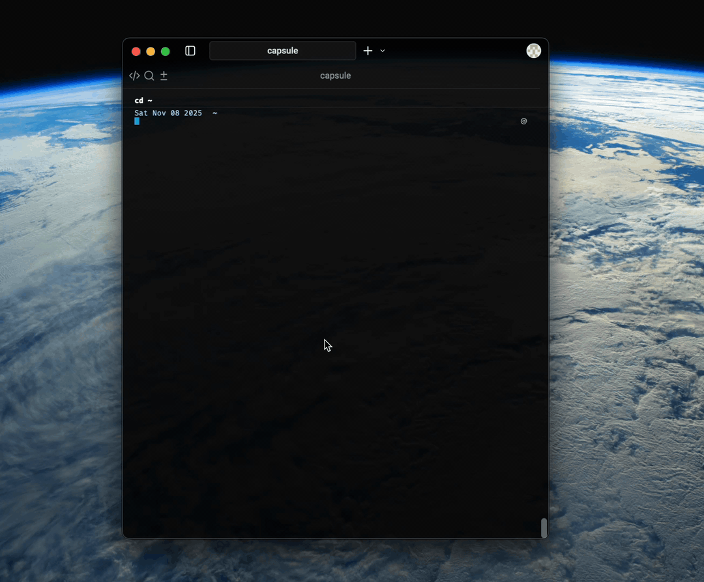

# Capsule

  

Kernel-First Security and Observability for AI Agents

Made by Ghostlock, Corp.

---

## TL;DR

Capsule watches agent behavior from the kernel (eBPF/LSM), enriches events into human-readable timelines, and lays the groundwork for dynamic, policy-driven security backed by small ML models. It’s **pre-alpha**, **Linux aarch64 only** right now, written in **Rust**.

---

## Why we are building Capsule

At Ghostlock, Corp., we believe that:

- Agents will become the basis of an increasing amount of human–computer interaction over the next decade.
- Agents will have increasing autonomy to write code to solve problems and make decisions in critical situations with less human oversight over time.
- Monitoring the behavior and intent of intelligent agents will become a major part of the human role in computing-based pursuits, at work and at home.
- The [application layer](https://www.first.org/resources/papers/telaviv2019/Ensilo-Omri-Misgav-Udi-Yavo-Analyzing-Malware-Evasion-Trend-Bypassing-User-Mode-Hooks.pdf) is trivially easy for an attacker or intelligent AI to circumvent, and observability and security tools that only run in userspace are effectively useless in an era approaching some version of AGI.
- Attackers will have increasing access to powerful models that will be able to [analyze systems and networks for vulnerabilities](https://arxiv.org/abs/2404.08144), essentially making complex cybercrimes as accessible as scam calls are today. Similar concerns have been raised by [DeepMind](https://deepmind.google/discover/blog/evaluating-potential-cybersecurity-threats-of-advanced-ai/) and observed by [Google](https://therecord.media/google-llm-sqlite-vulnerability-artificial-intelligence); see also recent work on teams of LLM agents exploiting zero-day [vulnerabilities/exploits](https://arxiv.org/html/2406.01637v2).
- Companies, even in highly regulated sectors, still have insufficient or inconsistent observability trails for the software they rely on and sell. This will become a huge issue in the near future as powerful AI models become more widely adopted and understood.
- Kernel-level tracing is not accessible enough, requiring too much configuration and system-level knowledge to get started.

---

## What Capsule observes

| Area                 | In plain terms                                              |
| -------------------- | ----------------------------------------------------------- |
| Process execution    | When programs start, fork, or become backgroud processes    |
| Network              | All network communication—who talks to whom.                |
| File I/O             | Read/write/create/delete/move files and folders.            |
| Credentials          | Changes to identity (UID/GID/capabilities).                 |
| Memory / code        | Risky mappings (e.g., W+X), code loading.                   |
| IPC orchestration    | Local process-to-process comms (pipes, UNIX sockets, etc.). |
| Device access        | Access to `/dev/*` (KVM, tun/tap, GPU, disks, USB/TTY).     |
| System configuration | Mounts, chroot/pivot_root, persistence paths.               |
| Containers & cgroups | Enter/leave namespaces; resource limits and cgroup changes. |
| Signals              | Software interrupts (SIGKILL, SIGTERM, etc.).               |

---

## Architecture

- **Kernel Probes**: eBPF kprobes/tracepoints/LSM hooks (Linux) capture syscall-level and semantic events.
- **Userspace Daemon**: stream ingestion, async enrichment of syscalls for better readability.
- **Policy/ML Layer**: deterministic rules + sequence/graph model that categorizes prompt, syscall sequence, and resource utilization combinations as risky or harmless.
